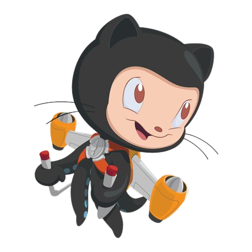

<h1 align="left">Hi 👋, I'm Ketan!</h1> 
<h3 align="left">Web Developer 🤓</h3>

<h1 align="left">About me 🧙‍♂️ : </h1> 
 
Hi I'm A Tech nerd 🧑‍💻
 
 

- 🌱 I’m currently learning **React and DSA**
- 📑 Here's my [Resume](https://drive.google.com/file/d/1zi180gFerL1HIK6lzFZVHC3C3cyY1ype/view?usp=sharing)
- 🤓 I’m currently working on NextJs, Typescript, Nodejs, Express.js and DSA

 
 

. 

<h1 align="left">Connect with me:</h1>

&nbsp;
&nbsp;

<h1 align="left">Languages and Tools:</h1>
 

  

 

###

  
  

